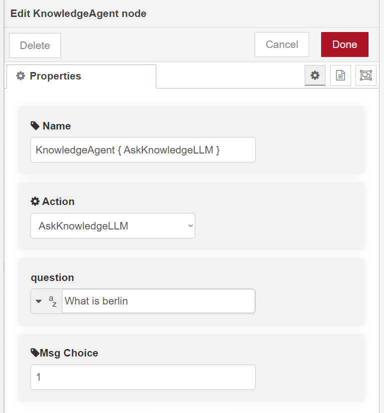
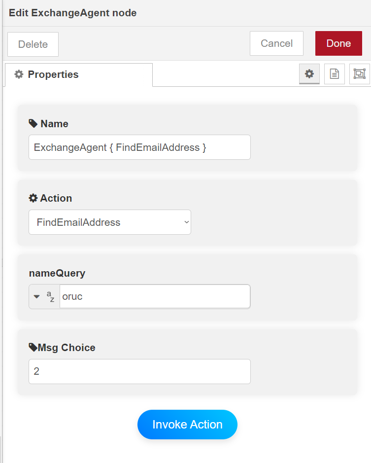
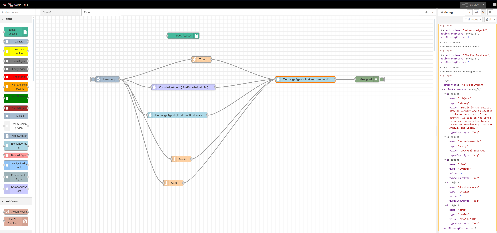
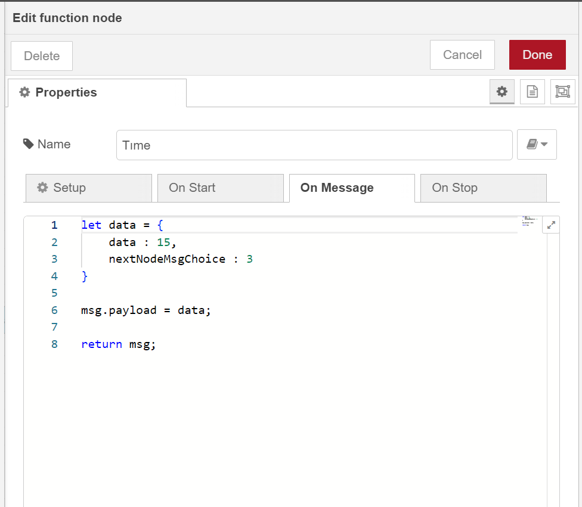

# Multi-Input Handling in Custom Node-RED Nodes

## Overview

In standard Node-RED, each node is typically designed to process a single input (`msg.payload`) at a time. This can be limiting when building complex flows that require multiple inputs from different sources to be processed together. To overcome this limitation, I developed a custom solution within the OPACA framework that allows a single node to handle multiple inputs before triggering an action.

This README provides a comprehensive guide on how this custom multi-input handling works, complete with code examples and detailed explanations.

## Problem Statement

### Standard Node-RED Limitation

By default, Node-RED nodes can only handle one `msg.payload` at a time. If you have a scenario where a node needs to wait for multiple inputs from different sources, Node-RED would typically require complex workarounds involving multiple nodes, which can be cumbersome and prone to errors.

### The Need for a Custom Solution

In many real-world applications, it's common to encounter situations where multiple inputs need to be gathered and processed together. For example, consider a scenario where data from multiple sensors needs to be collected and combined before making a decision or triggering an action. Handling these scenarios in standard Node-RED requires custom logic.

## Our Custom Solution

### How It Works

To address this limitation, we've implemented a custom solution that allows a single node to wait for and process multiple inputs. The core of this solution involves using a `Set` data structure to temporarily store the incoming `msg.payload` values, ensuring that each input is unique. Once all expected inputs are received, they are sorted and processed in the correct order, ensuring that the action is executed with complete and correctly ordered data.

### Detailed Workflow

1. **Initialization:**
   - A `Set` is initialized to store the incoming `msg.payload` values. The `Set` ensures that each input is stored only once, avoiding duplicate processing.

   ```javascript
   var allMsgInputs = new Set();
   ```

2. **Counting Expected Inputs:**
   - The node counts how many `msg.payload` inputs it should expect based on the configuration.

   ```javascript
   var numberOfMsgPayloads = node.agentCurrentActionParametersInfo.actionParameters.filter(parameter => parameter.typedInputType === 'msg').length;
   ```

3. **Storing Incoming Inputs:**
   - Each incoming `msg.payload` is added to the `Set`.

   ```javascript
   node.agentCurrentActionParametersInfo.actionParameters.forEach(parameter => {
       if(parameter.typedInputType === 'msg'){
           allMsgInputs.add(msg.payload);
       }
   });
   ```

4. **Checking for Completion:**
   - The node checks if the number of unique inputs stored in the `Set` matches the expected number of inputs. If all inputs have been received, the processing continues.

   ```javascript
   if(numberOfMsgPayloads === allMsgInputs.size){
   ```

5. **Sorting and Processing Inputs:**
   - The `Set` is converted into an array and sorted based on a specific property, such as `nextNodeMsgChoice`, to ensure that inputs are processed in the correct order.

   ```javascript
   let msgInputsAsArray = Array.from(allMsgInputs);
   msgInputsAsArray.sort((a, b) => {
       return a.nextNodeMsgChoice - b.nextNodeMsgChoice;
   });
   ```

6. **Assigning Values to Parameters:**
   - The sorted inputs are then assigned to the appropriate parameters for the action.

   ```javascript
   msgInputsAsArray.forEach(item => {
       var isFound = false;
       node.agentCurrentActionParametersInfo.actionParameters.forEach(parameter => {    
           if(parameter.value === "payload" && parameter.typedInputType === 'msg' && isFound === false){
               parameter.value = item.data;
               isFound = true;
           }
       });
   });
   ```

7. **Clearing the Set and Invoking the Action:**
   - After processing, the `Set` is cleared for future inputs, and the action is invoked.

   ```javascript
   allMsgInputs = new Set();
   await invokeAction(node.agentCurrentActionParametersInfo.actionName, node.agentCurrentActionParametersInfo.actionParameters, node.agentCurrentActionParametersInfo.nextNodeMsgChoice, msg);
   node.send(msg);
   ```

### Code Example: Full Node Handler

Here is a complete example of how this solution is implemented within a Node-RED custom node:

```javascript

// Initialize the Set to store unique msg.payload inputs.
var allMsgInputs = new Set();

node.on('input', async function(msg){ 
    if(node.agentCurrentActionParametersInfo  != null){

       // Get the number of expected msg.payload inputs.
       var numberOfMsgPayloads = node.agentCurrentActionParametersInfo.actionParameters.filter(parameter => parameter.typedInputType === 'msg').length;

       // Store each incoming msg.payload in the Set.
       node.agentCurrentActionParametersInfo.actionParameters.forEach(parameter => {
           if(parameter.typedInputType === 'msg'){
               allMsgInputs.add(msg.payload);
           }
       });

       // Check if all expected inputs have been received.
       if(numberOfMsgPayloads === allMsgInputs.size){
            
            // Convert the Set to an array and sort it.
            let msgInputsAsArray = Array.from(allMsgInputs);
            msgInputsAsArray.sort((a, b) => {
                return a.nextNodeMsgChoice - b.nextNodeMsgChoice;
            });

            // Assign the sorted inputs to the appropriate action parameters.
            msgInputsAsArray.forEach(item => {
                var isFound = false;
                node.agentCurrentActionParametersInfo.actionParameters.forEach(parameter => {    
                    if(parameter.value === "payload" && parameter.typedInputType === 'msg' && isFound === false){
                        parameter.value = item.data;
                        isFound = true;
                    }
                });
            });

            // Clear the Set and invoke the action.
            allMsgInputs = new Set();
            node.warn(node.agentCurrentActionParametersInfo);
            await invokeAction(node.agentCurrentActionParametersInfo.actionName, node.agentCurrentActionParametersInfo.actionParameters, node.agentCurrentActionParametersInfo.nextNodeMsgChoice, msg);
            node.send(msg);
       }
    }
});
```

### Multi-Input Handling in Custom Nodes: A Practical Example

In this section, we will illustrate how our custom multi-input handling solution works with specific examples. We will walk through a sample flow that shows how multiple inputs are gathered from different nodes, processed, and then used in a subsequent node.

#### Image 1: KnowledgeAgent Node Configuration


- **Node Name:** KnowledgeAgent {AskKnowledgeLLM}
- **Action:** AskKnowledgeLLM
- **Question Parameter:** The parameter `question` is set to `"What is Berlin"`. This invoke result will be sent as part of the `msg.payload` to the next node.
- **Msg Choice:** This is set to `1`, which is used to determine which parameter the incoming `msg.payload` should populate in the following node.

In this configuration, the `KnowledgeAgent` node is prepared to send its output (`msg.payload`) with the question "What is Berlin" and associate it with the parameter identified by `Msg Choice` value `1` in the next node.

#### Image 2: ExchangeAgent Node Configuration


- **Node Name:** ExchangeAgent {FindEmailAddress}
- **Action:** FindEmailAddress
- **nameQuery Parameter:** The parameter `nameQuery` is set to `"oruc"`. This will be sent as part of the `msg.payload` to the next node.
- **Msg Choice:** This is set to `2`, which will identify which parameter in the next node should be populated with the output of this node.

In this example, the `ExchangeAgent` node is configured to send its output (`msg.payload`) containing the name query "oruc" and assign it to the parameter identified by `Msg Choice` value `2` in the next node.

#### Image 3: Multi-Input Handling Flow



This image shows a complete flow in Node-RED where multiple inputs are combined and processed:

- **Timestamp Node:** Triggers the flow.
- **KnowledgeAgent Node:** Sends the `question` parameter ("What is Berlin") as `msg.payload`, with `Msg Choice` set to `1`.
- **ExchangeAgent Node:** Sends the `nameQuery` parameter ("oruc") as `msg.payload`, with `Msg Choice` set to `2`.
- **Function Nodes (`Time`, `Hours`, `Date`):** Additional nodes that generate specific inputs like time, hours, and date. These nodes also send their outputs with specific `Msg Choice` values.
- **ExchangeAgent Node (MakeAppointment):** This node is configured to receive multiple inputs. It waits for all the expected `msg.payload` inputs, and once all are received, it processes them according to the `Msg Choice` values.

## Important Note for Sending Message Payloads to OPACA Framework Agent Nodes
When using nodes other than the OPACA framework agent nodes (e.g., Node-RED’s official nodes or your custom nodes), it is essential that the input message payloads follow a specific format. This ensures that the OPACA framework agent nodes, such as the ExchangeAgent or KnowledgeAgent, can correctly process the incoming data.

## NOTE:
    For OPACA framework agent nodes themselves, this formatting is handled automatically in the backend. This instruction applies only when you're using non-OPACA nodes to send data into OPACA nodes.

**Required Payload Format:**    
    To ensure that the OPACA framework agent nodes correctly process the incoming data, the message payload must always be structured as follows when sending from non-OPACA nodes:



```javascript
        let data = {
            data: <value>,                 // The value you want to send to the next node can be any type of data
            nextNodeMsgChoice: <integer>    // The specific Msg Choice identifier that determines which parameter this data should populate in the next node
        };

        msg.payload = data;
        return msg;
```


##### How It Works:

1. **Gathering Inputs:**
   - Each preceding node sends a `msg.payload` that contains specific data (e.g., question, email query, time, date) along with a `Msg Choice` identifier.
   - These inputs are stored in a `Set` within the node, ensuring each input is unique and waiting until all required inputs are received.

2. **Processing Inputs:**
   - Once all expected inputs are received, the `Set` is converted to an array, sorted based on the `Msg Choice`, and then processed.
   - The sorted data is assigned to the correct parameters in the `MakeAppointment` node.

3. **Executing the Action:**
   - After sorting and assigning the inputs, the action (`MakeAppointment`) is triggered, combining all the inputs to make a comprehensive appointment request.

By using the `Msg Choice` parameter, this flow ensures that each piece of data is assigned to the correct parameter in the final node, demonstrating the flexibility and power of custom nodes in handling complex workflows.

## Why This Solution is Effective

### Flexibility
This approach allows custom nodes to manage and process multiple asynchronous inputs seamlessly. Unlike standard Node-RED nodes, which are limited to a single input, this custom solution can wait for and handle multiple inputs, making it ideal for complex workflows.

### Order Preservation
The solution ensures that inputs are processed in the correct sequence, which is crucial for many operations. By sorting the inputs before processing, you can guarantee that the data is handled in the intended order.

### Reliability
By storing the inputs in a `Set` and waiting for all expected inputs to arrive, the solution prevents partial data processing. Actions are only triggered when all necessary information is available, reducing the risk of errors and ensuring data integrity.

## Limitations of Standard Node-RED Nodes

In official Node-RED nodes, this kind of multi-input handling is not natively supported. Typically, each node processes only one input at a time, which can lead to challenges when building more sophisticated flows that require the aggregation of data from multiple sources.

## Conclusion

This custom solution showcases the power and flexibility of extending Node-RED's capabilities. By enabling nodes to handle multiple inputs before triggering an action, we've provided a robust method for creating complex and reliable automation flows within the OPACA framework.

This approach not only fills a gap left by standard Node-RED nodes but also enhances the overall functionality of the system, making it better suited for real-world applications where data from multiple sources often needs to be aggregated and processed together.
