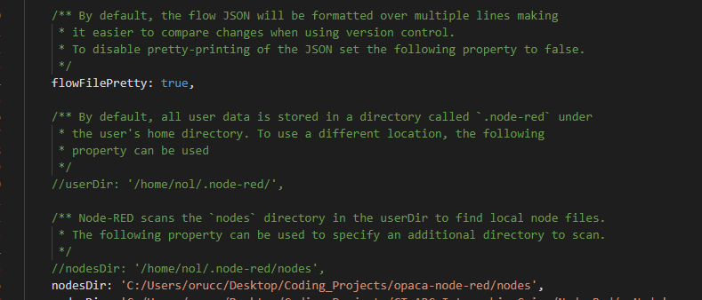

# OPACA Framework Node-RED Integration

## Overview

This project integrates the OPACA framework agens with Node-RED, a visual programming tool that allows for the flow-based development of applications. In this project, each Node-RED node represents a specific agent from the OPACA framework. These agents perform various roles, such as managing data exchange, interacting with external systems, and automating tasks. The goal of this project is to demonstrate how the OPACA framework can be effectively utilized within Node-RED to create a dynamic, responsive system.

## Project Structure

The project is organized into multiple directories, each corresponding to a particular agent or utility within the OPACA framework. These directories contain the necessary logic to define the behavior of each agent when represented as a Node-RED node. Below is a detailed description of each module:

### 1. **BaseAgent**
   - **Purpose:** This agent is not directly a opaca agent. This agent actually can be any opaca agent depending on the selected agent id by user.
   - **Role in Node-RED:** It has an input filed called as Agent ID. User can select the agent based on agent id. With the help of `opaca-access` node current agents are shown in the dropdown menu on the BaseAgent edit dialog. If new agent is added to stystem. User can use this node to use this new agent. However, if the user wants to use this new agent as a distinct node, user should create this agent node. Normally creating new agent node consists of creating two files. One of them is with .hmtl extension, the other is with .js extension. Thanks to `NodeCreator` node, user can automatically add new agent as NODE-RED node by filling the input fields of `NodeCreator` edit dialog.
   - [Detailed Documentation](./nodes/BaseAgent-node/BaseAgent.md)

### 2. **Camera**
   - **Purpose:** Manages camera devices, including image capture and video streaming, crucial for monitoring and real-time analysis.
   - **Role in Node-RED:** Integrates visual data into Node-RED flows, enabling real-time image processing within the OPACA framework.
   - [Detailed Documentation](./nodes/camera-node/camera.md)

### 3. **ChatBot**
   - **Purpose:** Provides a conversational interface for users, allowing interaction with the system via natural language processing, voice recognition and object detection.
   - **Role in Node-RED:** Translates user input into actions within Node-RED flows, facilitating a user-friendly interface for the OPACA framework.
   - [Detailed Documentation](./nodes/ChatBot-node/ChatBot.md)

### 4. **ExchangeAgent**
   - **Purpose:** Facilitates secure and efficient data exchange within the OPACA framework.
   - **Role in Node-RED:** Handles the flow of data between various nodes, ensuring seamless communication within the system.
   - [Detailed Documentation](./nodes/exchange-agent-node/ExchangeAgent.md)

### 5. **FridgeAgent**
   - **Purpose:** Manages smart fridge operations, such as adding removing groceries from fridge.
   - **Role in Node-RED:** Integrates these functionalities into Node-RED, allowing for automated control of the fridge environment.
   - [Detailed Documentation](./nodes/fridge-agent-node/FridgeAgent.md)

### 6. **HomeAssistantAgent**
   - **Purpose:** Interfaces with home automation platforms like Home Assistant, extending the OPACA framework's reach into home automation.
   - **Role in Node-RED:** Acts as a bridge between Node-RED and smart home devices, enabling their integration into the OPACA-based system.
   - [Detailed Documentation](./nodes/home-assistant-agent-node/HomeAssistantAgent.md)

### 7. **InvokeAction**
   - **Purpose:** Use all agents actions in one node.
   - **Role in Node-RED:** This node is not specific to any agent. This node has all the agents actions to be invoked.
   - [Detailed Documentation](./nodes/invoke-action-node/invoke-action.md)

### 8. **NodeCreator**
   - **Purpose:** Provides utilities for creating custom nodes in Node-RED, allowing for the expansion of OPACA framework functionalities within the Node-RED environment.
   - **Role in Node-RED:** Facilitates the development of new, specialized agents within Node-RED. Do not forget that users can use this node to create only opaca agents specific nodes. If you successfully create a new node, you will see success messagge on the `NodeCreator` edit dialog. Do not fortget to restart node-red after creating new node. It is about NODE-RED. If a custom node is created, NODE-RED should be restarted to register this newly created node to node red editor.
   - [Detailed Documentation](./nodes/NodeCreator-node/NodeCreator.md)

### 9. **OpacaAccess**
   - **Purpose:** Manages access control and security within the OPACA framework, ensuring that only authorized agents and users can interact with the system.
   - **Role in Node-RED:** Enforces security measures within Node-RED, protecting the system from unauthorized access.
   - [Detailed Documentation](./nodes/opaca-access-node/opaca-access.md)

### 10. **RoomBookingAgent**
   - **Purpose:** Manages room booking and scheduling, providing a system for reserving and managing shared spaces.
   - **Role in Node-RED:** Integrates room scheduling into Node-RED flows, allowing for automated booking and management within the OPACA framework.
   - [Detailed Documentation](./nodes/room-booking-agent-node/RoomBookingAgent.md)

### 11. **ServletAgent**
   - **Purpose:** Provides servlet-based interactions, enabling web-based control and monitoring of the system.
   - **Role in Node-RED:** Integrates web interfaces with the OPACA framework, allowing for browser-based management of system components.
   - [Detailed Documentation](./nodes/servlet-agent-node/ServletAgent.md)

### 12. **ShelfAgent**
   - **Purpose:** Manages smart shelves, opening closing a shelf or controling shelf contents.
   - **Role in Node-RED:** Essential for inventory management within the OPACA framework, integrating real-time tracking into Node-RED.
   - [Detailed Documentation](./nodes/shelf-agent-node/ShelfAgent.md)

### 13. **WayfindingAgent**
   - **Purpose:** Provides wayfinding assistance, helping users navigate complex environments within large facilities.
   - **Role in Node-RED:** Integrates navigation support into Node-RED flows, enabling real-time guidance within the OPACA framework.
   ## Note:
      This agent is not working with ZEKI-WIFI. Because it has its own WIFI. When this issue is fixed. This agent node will work properly.
   - [Detailed Documentation](./nodes/wayfinding-agent-node/WayfindingAgent.md)

## Resources Directory

###  **Common HTML Template**
   - **Purpose:** Provides a standardized HTML template used across various web-based components of the project.
   - [Detailed Documentation](./nodes/resources/common_html_template.md)

###  **HTML Common Methods**
   - **Purpose:** Contains reusable HTML methods that support the development of web interfaces within the project.
   - [Detailed Documentation](./nodes/resources/html_common_methods.md)

###  **JavaScript Common Methods**
   - **Purpose:** Offers a set of JavaScript methods commonly used across different modules, facilitating code reuse.
   - [Detailed Documentation](./nodes/resources/js_common_methods.md)

###  **Imports**
   - **Purpose:** Manages the import of necessary libraries and dependencies required by the project’s modules.
   - [Detailed Documentation](./nodes/resources/imports.md)

###  **Node Configuration**
   - **Purpose:** Provides configuration settings for custom nodes, allowing for easier setup and integration of new nodes in Node-RED.
   - [Detailed Documentation](./nodes/resources/node_config.md)

## Prerequisites

### Node-RED Installation

To use this project, you need to have Node-RED installed. Node-RED is essential for deploying and interacting with the OPACA framework agents as nodes.

1. **Install Node-RED:**
   - Node-RED can be installed on various operating systems. Follow the instructions on the [Node-RED official website](https://nodered.org/docs/getting-started/) to install it.

2. **Make Configurations:**
   - After installing go to installation directory named as `.node-red`.
   - Open this directoy, you should see a javascript file called as `settings`. Then open this js file to make configurations to to be able to see custom nodes on the palette and to be able to see the custom nodes under the category name ``ZEKI`.
   1) NODE-RED needs you to provide custom nodes directoy path to upload them to NODE-RED editor. Therefore you need to enter the `opaca-node-red/nodes` directory full path to setting file. Assign your full path to `nodesDir` property in the settings file as shown below.

   

   2) As you can see in the example flows, `ZEKI` palette is shown on at the top. If you want `ZEKI` palette to be shown at top. You need to assign categories property as shown below.

   

   ## Note:
         If you do not assign catehory property, `ZEKI` category custom nodes will be shown at the bottom by default.

2. **Start Node-RED:**
   - After installation and making necessary configurations, run Node-RED by entering `node-red` in your terminal. The Node-RED editor will be accessible at `http://localhost:1880`.

3. **Deploy the Project:**
   - Import the provided JSON flow files into Node-RED and deploy them or you can make your own flows. These flows represent the interactions and operations of the OPACA agents within the Node-RED environment.

## Important Notes

1. **Re-authentication with OpacaAccess Node:**
   - When working with custom nodes in Node-RED, especially while accessing `http://localhost:1880`, it is important to note that if you refresh the Node-RED page, you will need to re-authenticate using the OpacaAccess node. This ensures that all interactions remain secure and that access control is maintained. Whenever you drag a new custom node from `ZEKI` palette you need to again make authorization.

2. **Deploying Changes:**
   - Whenever you make any changes to the nodes in your flow, it is crucial to click the **Deploy** button in Node-RED. If you do not deploy after making changes, the flow will continue to run with the old parameters, which could lead to unexpected behavior. Always ensure that your changes are deployed to keep the flow operating with the latest configuration.

---

This README provides a detailed overview of how the OPACA framework agents are represented and utilized within Node-RED, offering a clear guide for setting up and using this integrated system.
