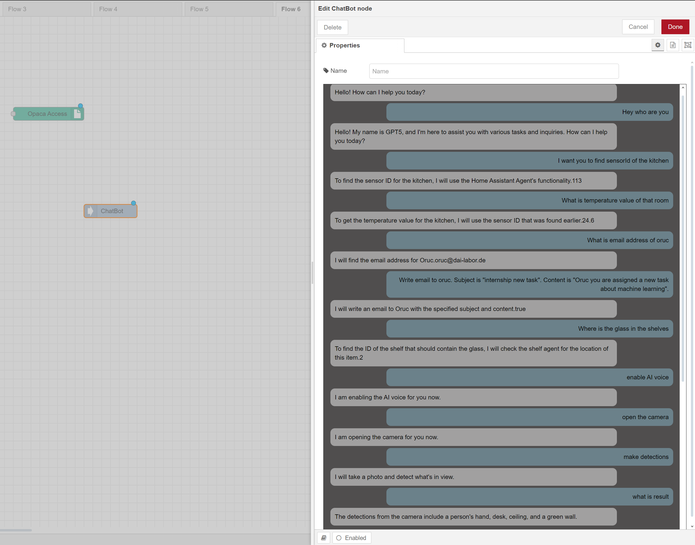
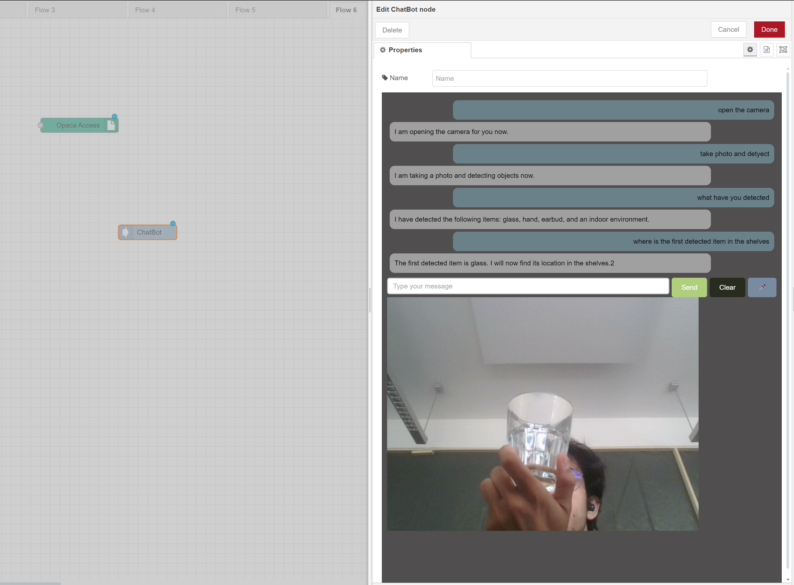

# ChatBot Node Documentation

## Overview

The ChatBot node is a highly advanced and versatile tool designed to interact with the OPACA framework. This node is capable of understanding and executing various tasks based on user input provided via text, voice, or images. It can invoke specific actions on agents registered within the OPACA framework, handle custom agents like `camera-agent` and `voice-agent`, and respond to the user in a meaningful and context-aware manner.

## Features

1. **Multi-Modal Input Handling**: 
    - The ChatBot node can process user inputs in the form of text, voice, and images.
    - It uses OpenAI's API for natural language processing, enabling it to understand and act on complex user prompts.

2. **OPACA Framework Integration**: 
    - The node fetches all agents and their actions from the OPACA framework, allowing it to understand and interact with these agents effectively.
    - It invokes actions based on user commands and provides the results to the user either in text or through synthesized speech.

3. **Custom Agent Handling**: 
    - The ChatBot node supports custom agents such as `camera-agent` and `voice-agent`, which are not part of the OPACA framework but have been integrated into the node's functionality.
    - These custom agents can be managed through backend code that is specifically written to handle their actions.

4. **Context Awareness**: 
    - The ChatBot node maintains a conversation history, allowing it to provide contextually relevant responses.
    - If a user repeats a request or asks a follow-up question, the ChatBot can refer to previous interactions and provide consistent and accurate responses.

5. **Dynamic Action Invocation**: 
    - The node dynamically invokes actions on agents based on user input and provides the results back to the user in real-time.

6. **Voice Interaction**: 
    - The node uses OpenAI's text-to-speech (TTS) capabilities to deliver voice responses to the user.
    - Users can also provide voice commands, which are transcribed and processed by the ChatBot.

7. **Error Handling and Feedback**: 
    - The node provides real-time feedback to the user, displaying success or failure messages depending on the outcome of the requested actions.

8.  **Example Conversation**:
    - Here example conversation is added. User can prompt anything about agent and actions.Maybe user wants this chatbot to be able to use other purposes. It can be done beacuse chatbot is able to differentiate between agent related prompts or not related prompts. You can see the exmaple conversation below.

As you can see above, you can open or close the camera at the bottom of conversation history just by saying or writing "open or close the camera" or you can make chatbot speak just by saying or writing "enable ai voice". Also, you can disble AI voice, just by saying or writing "disable AI voice.
This chatbot is powerful in terms of remembering past queries. For example above first prompt is "I want you to find sensorId of the kitchen". ChatBot finds the sesnorID.
Second prompt is "What is temperature value of that room". Normally we do not expect to chatbot to understand this and give answer. However, with the help of history or context property that are implemented by me. It remmembers that "that toom means 'kitchen'"  and also use previous action result to get the temperature value of that sensor.

Another powerful feature is to be able to use object detection. It is a bit slow but accuracy is very high and also when you make detections you can use this detection results to call another actions as you can see below.

Here user wants chatbot to open the camera and make detections. After detection user wants to find the location of the first detected object (here, glass has the most detection percentage) location in the shelves. Then chatbot use detections results to call the `FindInShelf` action of the `ShelfAgent`.

## Note:
    - If you want to ask question to chatbot with your voice, the only thing you shoud do is to press "R" keyword on the keybord. When you press "R", it starts to record your voice, when you release "R" keyword it converts detected voice command to text and send this messagge to chat-gpt api. 

## Usage

### Setting Up the Node

1. **Configuration**:
    - The node requires an OpenAI API key to function. This API key should be set up in the environment variables (`process.env.OPENAI_API_KEY`).
    - The ChatBot node also requires access to the OPACA framework for fetching agent details and invoking actions.

2. **UI Interaction**:
    - The node's user interface includes a chat container where users can type messages, send voice commands, or upload images for analysis.
    - The node handles the inputs, processes them through OpenAI's API, and returns the results in the chat history.

### Handling Custom Agents

The ChatBot node supports custom agents that are not part of the OPACA framework, such as the `camera-agent` and `voice-agent`. These agents are managed through backend code that processes their specific actions:

- **Camera Agent**:
    - The `camera-agent` allows the user to open or close the camera and capture images for object detection.
    - The captured images can be analyzed using OpenAI's image processing capabilities.

- **Voice Agent**:
    - The `voice-agent` manages AI voice functionality, allowing the user to enable or disable AI voice responses.

### Context-Aware Responses

The ChatBot node maintains a conversation history, enabling it to provide contextually relevant responses. For example:

- If the user requests an action that has been invoked previously, the node can provide the cached result without re-invoking the action.
- The node can maintain the context of a conversation and provide answers that are consistent with previous interactions.

### Error Handling

The node provides feedback on the success or failure of each operation:

- **Success Message**: Displayed when an action is successfully invoked.
- **Failure Message**: Displayed when an action fails to invoke or if there is an issue with the input provided.

## API Integration

### OpenAI API

## Note:
    Users should define their own api key in the computer environment variables with the name of "OPENAI_API_KEY" in order to use this `ChatBot-node` on the node-red.
    Camera node and ChatBot node needs to "OPENAI_API_KEY" to be defined in the computer environment variables.

The ChatBot node integrates with OpenAI's API for various tasks, including:

- **Text-to-Speech (TTS)**: Synthesizes voice responses based on text input.
- **Speech-to-Text (STT)**: Transcribes voice commands into text.
- **Image Analysis**: Processes images provided by the user and returns relevant information.

## Conclusion

The ChatBot node is a powerful tool for interacting with the OPACA framework and custom agents. It provides a flexible interface for users to interact with agents, invoke actions, and receive context-aware responses. The node's ability to handle various input modalities and maintain conversation context makes it an essential component of any advanced automation or AI-driven system.
