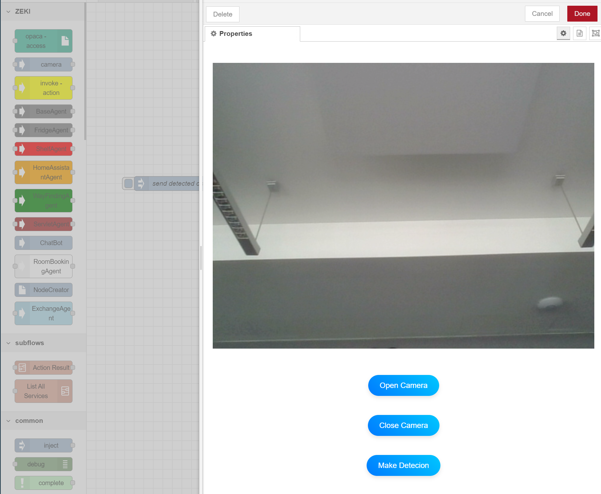

# Camera Node Documentation

## Overview
The `camera-node` is designed to interface with camera devices within the Node-RED environment. It allows users to make object detection and use object detection results within their Node-RED flows. This node is particularly useful for applications involving object detection. For example, the user may want to know about detected object location in the kitchen shelves. Firstly `camera-node` edit dialog should be opened. Secondly by pressing make detection button object detection should be made and by injecting the inject node detection results should be sent to `shelf-agent-node`. Thirdly, user can use `FindInShelf` action of the agent `shelf-agent` to find the location of the detected object.

## Directory Structure

- **`camera.html`**: Defines the user interface (UI) for configuring the `camera-node` within the Node-RED editor.
- **`camera.js`**: Implements the logic and behavior of the `camera-node` in the Node-RED runtime.
## Detailed Explanation of Files

### 1. `camera.html`
This file sets up the Node-RED editor interface for the `camera-node`. It includes elements for opening, closing camera and making detection.
For object detection openai `gpt-4o-mini` model is used. This model is slow, but it's accuracy is high. On the `camere-node` edit dialog, when user press the make detection button, chat-gpt explanative response describing the detected objects is displayed on the screen in approximately three seconds.
This `camera.hmtl` file gets detected objects and send results to `camera.js` in order to convey results to next node in the flow.

For this camera node to be make detection, it needs open-ai key. In the `camera.js` below code gets OPENAI_API_KEY from computer environment variables.
And then send this key to `camera.html` because we use apı key in method sendMessageWithImage.

## Note:
    Users should define their own api key in the computer environment variables with the name of "OPENAI_API_KEY" in order to use this `camera-node` on the node-red.

## Note:
    Camera class and captureImageFromCanvas, sendMessageWithImage, parseGPTResponse methods are already defined in `ChatBot-node`, it means there is no need to define them in this node again.

**Key Components**:
- **Video and Canvas Elements**: The HTML includes `<video>` and `<canvas>` elements for displaying the live camera feed and capturing images.
- **Form Elements**: Input fields and buttons allow users to start/stop the camera, capture images, and adjust settings directly from the Node-RED UI.

**Example UI Elements**:
```html
<video id="webcam" autoplay playsinline width="800" height="640"></video>
<canvas id="canvas" width="800" height="640" style="display: none;"></canvas>
<button id="captureButton">Capture Photo</button>
```

### 2. `camera.js`
The JavaScript file implements the runtime logic for the `camera-node`. It handles tasks such as:
- Sending open-ai key to `camera.html`
- Getting detected object results from `camera.html` and displaying results on the node-red debug screen and sending the detected object which has the highest detection percentage to next node.

**Key Functions**:
- **`RED.nodes.registerType("camera", CameraNode)`**: Registers the `camera-node` within Node-RED, making it available for use in flows.

## Usage Example

### Adding the `camera-node` to a Flow
1. Drag the `camera-node` from the Node-RED palette into your flow.
2. Double-click the node to open its configuration UI.
3. Open the camera and by pressing make detection button to make detections.



4. Close edit dialog and return to the flow screen. 
5. Drag official node-red `inject-node` to flow and connect to `camera-node`.
6. Press inject node, this trigger the camera node to send the object that has the highest confidence.


### Practical Application
- **Surveillance Systems**: Use the `camera-node` to monitor and capture images from a security camera.
- **Image Recognition**: Integrate the `camera-node` with image recognition services to analyze captured images and trigger actions based on detected objects.

## Conclusion
The `camera-node` is a versatile tool in the Node-RED environment, providing the capability to work with visual data. Its integration with shared resources ensures that it functions smoothly within complex flows, offering users a powerful way to incorporate camera functionality into their Node-RED projects.
